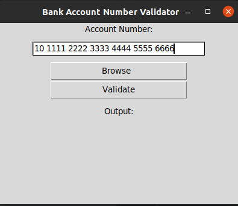

# account-number-validator

__Account number validator__ - parse image in search of bank account number and compare it 
with input bank account number.

This is useful when you want to do a bank transfer from a paper document.
To prevent any mistakes. You can take a picture of a paper document and use it as an input image.

 

## Running

First `tesseract-ocr` is needed 

> sudo apt-get install tesseract-ocr

### Old terminal version

> python3 main.py -i image.jpg -an "00 1234 1234 0000 1234 1234 1234"

### New GUI version

> python3 anv.py

## venv

env activation

> source activate

Python packages
> pip install -r requirements.txt

